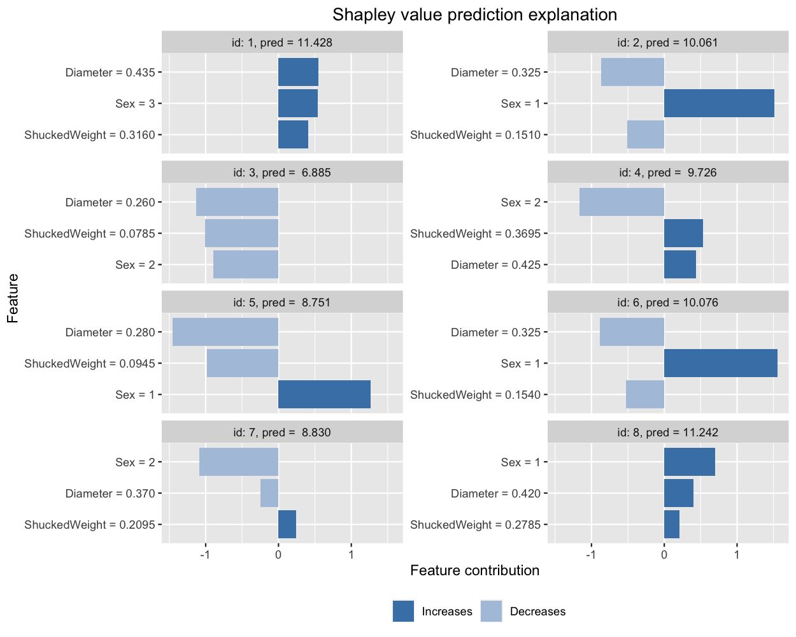

# Shapley values and the VAEAC method

In this GitHub repository, we present the implementation of our `VAEAC` and `  ` 

`VAEAC<sub>C</sub>`
approaches to Shapley value estimation from our paper "Using Shapley Values and Variational Autoencoders to Explain Predictive Models with Dependent Mixed Features", see [Olsen et al. (2022)](https://arxiv.org/abs/2111.13507). 

The variational autoencoder with arbitrary condiditioning (`VAEAC`) approach is based on the work of (Ivanov et al., 2019) and we extend it to `VAEAC_C` which employs a simple but effective masking scheme to Shapley value estimation in sampled high-dimensions, see [Olsen et al. (2022)]. The `VAEAC` is an extension of the regular variational autoencoder (Kingma and Welling, 2019). Instead of giving a probabilistic representation for the distribution ) it gives a representation for the conditional distribution ), for all possible feature subsets  simultaneously, where  is the set of all features.

To make the `VAEAC` methodology work in the Shapley value framework, established in the R-package [`Shapr`](https://github.com/NorskRegnesentral/shapr) (Sellereite and Jullum, 2019), we have made alterations to the [original implementation](https://github.com/tigvarts/vaeac) of Ivanov.

The `VAEAC` model is implemented in Pytorch, hence, that portion of the repository is written in Python.
To compute the Shapley values, we have written the necessary R-code to make the `VAEAC` approach run on top of the R-package `shapr`.

NOTE: the code will be updated in week 16 to also include non-uniform masking schemes specified by the user.

## Setup

In addition to the prerequisites required by [Ivanov](https://github.com/tigvarts/vaeac/blob/master/requirements.txt), we also need several R-packages. All prerequisites are specified in `requirements.txt`. 

This code was tested on Linux and macOS (should also work on Windows), Python 3.6.4, PyTorch 1.0. and R 4.0.2.

To user has to specify the system path to the Python environment and the system path of the downloaded repository in `Source_Shapr_VAEAC.R`.


## Example

The following example shows how a random forest model is trained on the *Abalone* data set from the UCI machine learning repository, and how `shapr` explains the individual predictions.

Note that we only use **Diameter** (continuous), **ShuckedWeight** (continuous), and **Sex** (categorical) as features and let the response be **Rings**, that is, the age of the abalone.


``` r
# Import libraries
library(shapr)
library(ranger)
library(data.table)

# Load the R files needed for computing Shapley values using VAEAC.
source("ShapleyValuesVAEAC/Source_Shapr_VAEAC.R")

# Set the working directory to be the root folder of the GitHub repository. 
setwd("ShapleyValuesVAEAC")

# Read in the Abalone data set.
abalone = readRDS("data/Abalone.data")
str(abalone)

# Predict rings based on Diameter, ShuckedWeight, and Sex (categorical), using a random forrest model.
model = ranger(Rings ~ Diameter + ShuckedWeight + Sex, data = abalone[abalone$test_instance == FALSE,])

# Specifying the phi_0, i.e. the expected prediction without any features.
phi_0 <- mean(abalone$Rings[abalone$test_instance == FALSE])

# Prepare the data for explanation. Diameter, ShuckedWeight, and Sex correspond to 3,6,9.
explainer <- shapr(abalone[abalone$test_instance == FALSE, c(3,6,9)], model)
#> The specified model provides feature classes that are NA. The classes of data are taken as the truth.

# Train the VAEAC model with specified parameters and add it to the explainer
explainer_added_vaeac = add_vaeac_to_explainer(
  explainer, 
  epochs = 30L,
  width = 32L,
  depth = 3L,
  latent_dim = 8L,
  lr = 0.002,
  num_different_vaeac_initiate = 2L,
  epochs_initiation_phase = 2L,
  validation_iwae_num_samples = 25L,
  verbose_summary = TRUE)

# Computing the actual Shapley values with kernelSHAP accounting for feature dependence using
# the VAEAC distribution approach with parameters defined above
explanation = explain.vaeac(abalone[abalone$test_instance == TRUE][1:8,c(3,6,9)],
                            approach = "vaeac",
                            explainer = explainer_added_vaeac,
                            prediction_zero = phi_0,
                            which_vaeac_model = "best")

# Printing the Shapley values for the test data.
# For more information about the interpretation of the values in the table, see ?shapr::explain.
print(explanation$dt)
#>        none   Diameter  ShuckedWeight        Sex
#> 1: 9.927152  0.63282471     0.4175608  0.4499676
#> 2: 9.927152 -0.79836795    -0.6419839  1.5737014
#> 3: 9.927152 -0.93500891    -1.1925897 -0.9140548
#> 4: 9.927152  0.57225851     0.5306906 -1.3036202
#> 5: 9.927152 -1.24280895    -1.1766845  1.2437640
#> 6: 9.927152 -0.77290507    -0.5976597  1.5194251
#> 7: 9.927152 -0.05275627     0.1306941 -1.1755597
#> 8: 9.927153  0.44593977     0.1788577  0.6895557

# Finally, we plot the resulting explanations.
plot(explanation, plot_phi0 = FALSE)
```




## Citation

If you find this code useful in your research, please consider citing our paper:
```
@misc{Olsen2022Shapley,
      title={Using Shapley Values and Variational Autoencoders to Explain Predictive Models with Dependent Mixed Features}, 
      author={Lars Henry Berge Olsen and Ingrid Kristine Glad and Martin Jullum and Kjersti Aas},
      year={2022},
      eprint={2111.13507},
      archivePrefix={arXiv},
      primaryClass={stat.ML},
      url={https://arxiv.org/abs/2111.13507}
}
```

## References

Ivanov,  O.,  Figurnov,  M.,  and  Vetrov,  D.  (2019).  “Variational  Autoencoder  with  ArbitraryConditioning”. In:International Conference on Learning Representations.

Kingma, D. P. and Welling, M. (2014). "Auto-Encoding Variational Bayes". In: 2nd International Conference on Learning Representations, ICLR 2014.

Olsen, L. H. B., Glad, I. K., Jullum, M. and Aas, K. (2021). "Using Shapley Values and Variational Autoencoders to Explain Predictive Models with Dependent Mixed Features".

Sellereite,  N.  and  Jullum,  M.  (2019).  “shapr:  An  R-package  for  explaining  machine  learningmodels with dependence-aware Shapley values”. In:Journal of Open Source Softwarevol. 5,no. 46, p. 2027.

